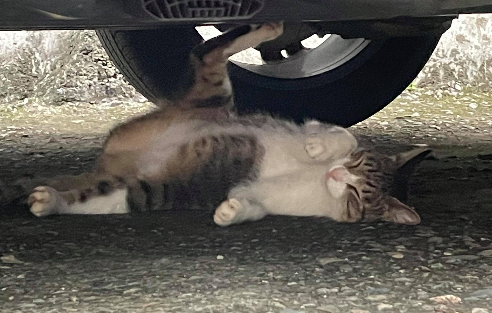

## Yo Yo Check It OUT :metal:

Most of the time I'm an AI Engineer, and the rest of the time learning to be a *Backend Engineer*.

### Backend Experience
- Was an intern at TrendMicro, Infra team (AWS) for one year.
- Backend engineer at Meteo. `FastAPI + Celery + RabbitMQ = Distributed System.`

### AI
- :musical_keyboard: Music Transcription, Research Assistent [@MCTLab](https://github.com/Music-and-Culture-Technology-Lab)
- :notes: Optical Music Recognition [@Meteo](https://github.com/meteo-team)

More details refer to my **PINNED** repo below :point_down:

...or just look at how adorable the little kitty is (-w-) Sleeps so well :relieved:

Have a chill day~

    

<!--
**BreezeWhite/BreezeWhite** is a ✨ _special_ ✨ repository because its `README.md` (this file) appears on your GitHub profile.

Here are some ideas to get you started:

- 🔭 I’m currently working on ...
- 🌱 I’m currently learning ...
- 👯 I’m looking to collaborate on ...
- 🤔 I’m looking for help with ...
- 💬 Ask me about ...
- 📫 How to reach me: ...
- 😄 Pronouns: ...
- ⚡ Fun fact: ...
-->
