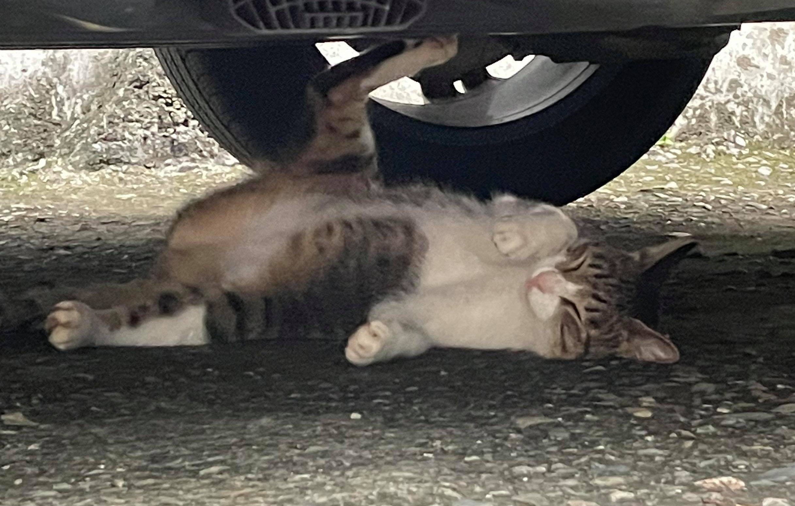

## Yo Yo Check It OUT :metal:

An AI & backend engineer. Learning and exploring between the two totally different fields brings lots of joy to me.

Japan ACG culture super lover. Already can't live without lovely things :heart:

### Programming Language
- Super  advocator 🐍. Live in zen with the philosophy of Python as a proud Pythonist.
-  &  was my first learned language.
- After that played in  world for a while.
- Start using  and cannot stop now.

### Projects I am proud of & Loved by the community
- :star: All-in-one AI music toolbox [omnizart](https://github.com/Music-and-Culture-Technology-Lab/omnizart) 
- :musical_score: Turn your music sheet image into audible melody [oemer](https://github.com/BreezeWhite/oemer) 
- :bullettrain_side: Taiwan High Speed Railway (THSR) ticket booking CLI [THSR-Ticket](https://github.com/BreezeWhite/THSR-Ticket) 
- :desktop_computer: Very easy-to-use AI colab collections [interesting-colabs](https://github.com/BreezeWhite/interesting-colabs) 

#### Also other funny tiny project
- :standing_man: 3D human reconstruction [pifuhd](https://github.com/BreezeWhite/pifuhd)
- :mag_right: Background remover for both image and video [segpeo](https://github.com/BreezeWhite/segpeo)
- :weight_lifting_woman: Minimum computation-heavy FastAPI template [simple-fastapi](https://github.com/BreezeWhite/simple-fastapi)

### Work with ME
Loved one or more of my works? You can find me and delegate work on 

Let's have a happy cooperation~

### Lastly
Wish you a chill day~ :relieved:

    

